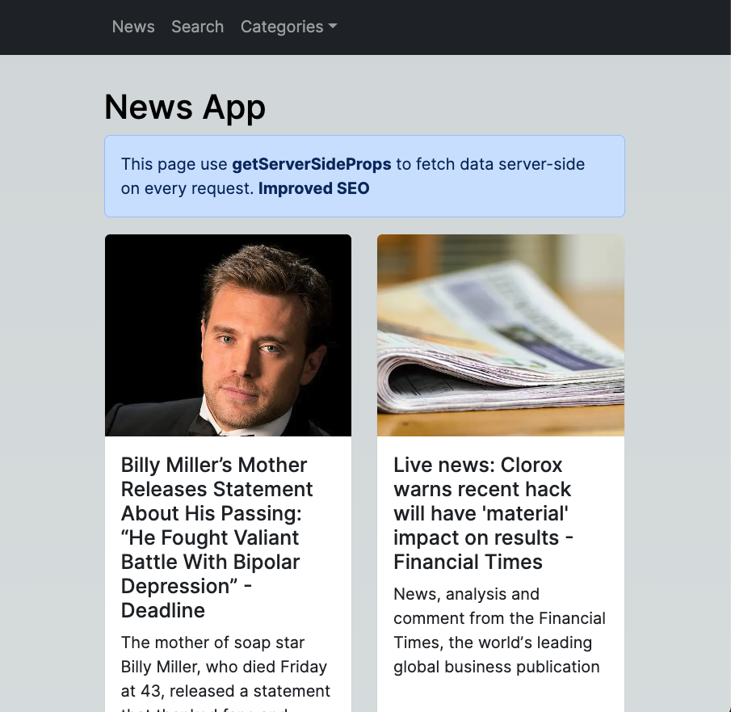
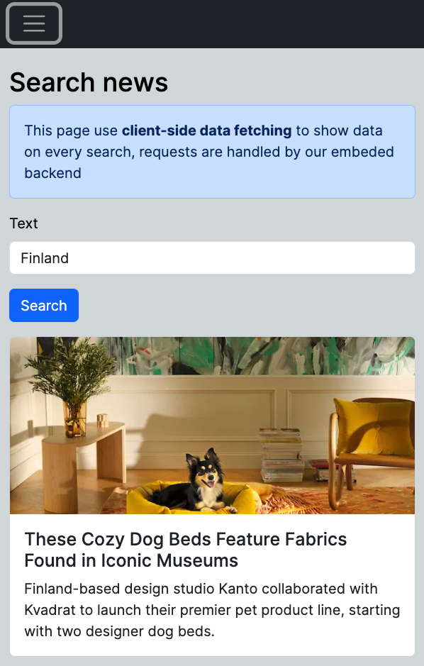
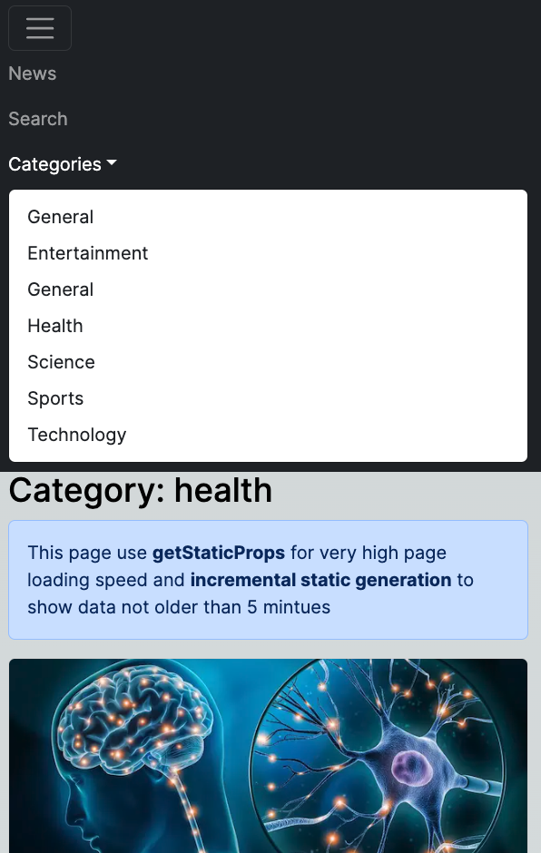

This is a [Next.js](https://nextjs.org/) project bootstrapped with [`create-next-app`](https://github.com/vercel/next.js/tree/canary/packages/create-next-app).

# About
This is the first time I use Next js, the porpuse of this project is to get started with it
and not make a good production ready app, so it's not the best app ever

I know it sound not very useful but I would like to share my code in repositories on Github

Thank you for your time.

## How to run

Make sure to create `.env.local` file in the root directory and then
create variable with name `NEWS_API_KEY` and you can get this api key from [newsapi.org](https://newsapi.org/)